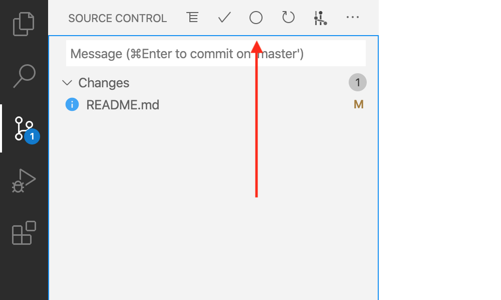

# VSCode Conventional Commits

[Conventional Commits](https://www.conventionalcommits.org/) for VSCode.

## Features

This extension helps you to fill in commit message according to
[Conventional Commits](https://www.conventionalcommits.org/).

- Support
  [commitlint configs](https://commitlint.js.org/#/reference-configuration). See
  [Supported Commitlint Rules](#supported-commitlint-rules) for details.
- Support auto commit and push after typing messages. See
  [Commit Workflow](#commit-workflow) for details.
- Support project level scope management.
- Support [gitmojis](https://gitmoji.carloscuesta.me/).
- Support VSCode workspaces.

## Usage

You can access VSCode Conventional Commits in two ways:

1. `Command + Shift + P` or `Ctrl + Shift + P`, enter `Conventional Commits`,
   and press `Enter`.
2. Click the icon on the Source Control menu. See the image below.

### Extension Configuration

|                name                | description                                                                                                                                                                                                                                                                                                   | default |
| :--------------------------------: | :------------------------------------------------------------------------------------------------------------------------------------------------------------------------------------------------------------------------------------------------------------------------------------------------------------ | :-----: |
|  `conventionalCommits.autoCommit`  | Controls whether the extension should automatically commit files. When `#git.enableSmartCommit#` enabled and `#git.smartCommitChanges#` was set to `all`, It allows to commit all changes when there are no staged changes. And set `#git.postCommitCommand#` to `sync` to run `git.sync` after commit. |  true   |
| `conventionalCommits.emojiFormat`  | Specifies which format will be shown in the `gitmoji`.                                                                                                                                                                                                                                                        |  code   |
|   `conventionalCommits.gitmoji`    | Controls whether the extension should prompt for a `gitmoji`.                                                                                                                                                                                                                                                 |  true   |
|  `conventionalCommits.lineBreak`   | Specifies which word will be treat as line breaks in the `body`. Blank means no line breaks.                                                                                                                                                                                                               |   ""    |
| `conventionalCommits.promptScopes` | Controls whether the extension should prompt for the `scope` section.                                                                                                                                                                                                                                         |  true   |
|    `conventionalCommits.scopes`    | Specifies available selections in the `scope` section.                                                                                                                                                                                                                                                        |   []    |
|  `conventionalCommits.showEditor`  | Show the commit message as a text document in a separate tab.                                                                                                                                                                                                                                                 |  false  |

## Commit Workflow

The recommended workflow automatically add, commit and push files by default.

If you want the extension to only fill in the message, disable `autoCommit`
configuration.

### The Recommended Workflow

1. Active the extension.
2. Type messages.

The extension will automatically add the changed files, perform the commit and
push the commit to remote.

### How To Configure `autoCommit`

1. Enable `Settings > conventionalCommits.autoCommit` configuration of the
   extension. _The extension enables `Settings > conventionalCommits.autoCommit`
   by default._
2. Enable `Settings > git.enableSmartCommit` and set
   `Settings > git.smartCommitChanges` to `all` to commit all changes when there
   are no staged changes.
3. Set `Settings > git.postCommitCommand` to `sync` to run `git.sync` after
   commit.

### Supported [Commitlint Rules](https://commitlint.js.org/#/reference-rules)

- [x] `body-full-stop`
- [ ] `body-leading-blank`
- [x] `body-max-length`
- [ ] `body-max-line-length`
- [x] `body-min-length`
- [ ] `footer-leading-blank`
- [x] `footer-max-length`
- [ ] `footer-max-line-length`
- [x] `footer-min-length`
- [x] `header-case`
- [x] `header-full-stop`
- [x] `header-max-length`
- [x] `header-min-length`
- [ ] `references-empty`
- [x] `scope-enum`
- [x] `scope-case`
- [x] `scope-empty`
- [x] `scope-max-length`
- [x] `scope-min-length`
- [x] `subject-case`
- [x] `subject-empty`
- [x] `subject-full-stop`
- [x] `subject-max-length`
- [x] `subject-min-length`
- [x] `type-enum`
- [x] `type-case`
- [x] `type-empty`
- [x] `type-max-length`
- [x] `type-min-length`
- [ ] `signed-off-by`

## FAQ

**Q:** How do I add a line break in messages?

**A:** Set `lineBreak` configuration to `\n`. When you're typing, enter `\n` as
a line break.

Or `\\n` in JSON format.

**Q:** How do I resolve `repo not found` error?

**A:** See issue discussion
[#15](https://github.com/vivaxy/vscode-conventional-commits/issues/15#issuecomment-633161627).

## Troubleshooting

1. Switch to the VSCode `OUTPUT` tab, select `Conventional Commits`.
2. Copy all the output. Before sharing it, make sure you have removed all
   private information.

## Team Members

- [vivaxy](https://github.com/vivaxy)
- [yi_Xu](https://github.com/yi-Xu-0100)

## Related Projects

- [gacp](https://github.com/vivaxy/gacp)
- [Commit Tagger](https://github.com/Mongkii/Commit-Tagger)
- [vscode-commitizen](https://github.com/KnisterPeter/vscode-commitizen)
- [Commit Message Editor](https://github.com/bendera/vscode-commit-message-editor)
- [commitji](https://github.com/jmaicaaan/commitji)
- [idea-conventional-commit](https://github.com/lppedd/idea-conventional-commit)
- [Git-commit-plugin For Vscode](https://github.com/RedJue/git-commit-plugin)
